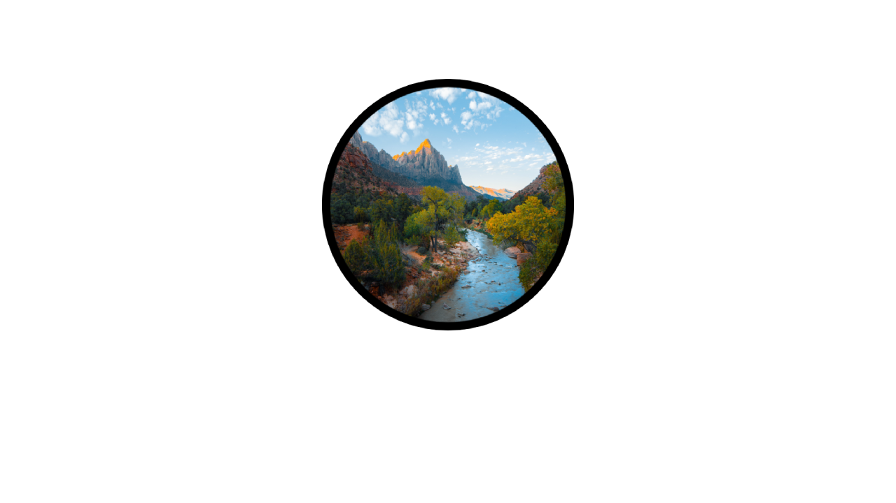

# Site Web officiel de Corundum
## Fonction
Site vitrine d'un projet qui arrivera sans doutes dans les années à venir.
## Langages utilisés
Ce site utilise des langages Web basiques, comme l'**HTML** ainsi que le **CSS**.
## Crédits
- [Enio Aiello](https://github.com/enioaiello)
